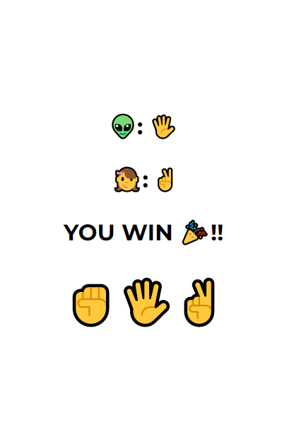

# JS-ROCK-PAPER-SCISSORS
 Basic JS 

I find this is a great exercise to practise lots of JS methods and functions: 

- .map() methods to mapover an array
- .append() method, used to add an element in form of a Node object or a DOMString (text)
- .appendChild() method, used to add elements in the DOM, but only accept a Node object (in which case I've used it to append an entire div(buttons) to the gameDiv
- .forEach() method 

- Math.random() function to generate computer choice 
- switch statement to generate results for the game 